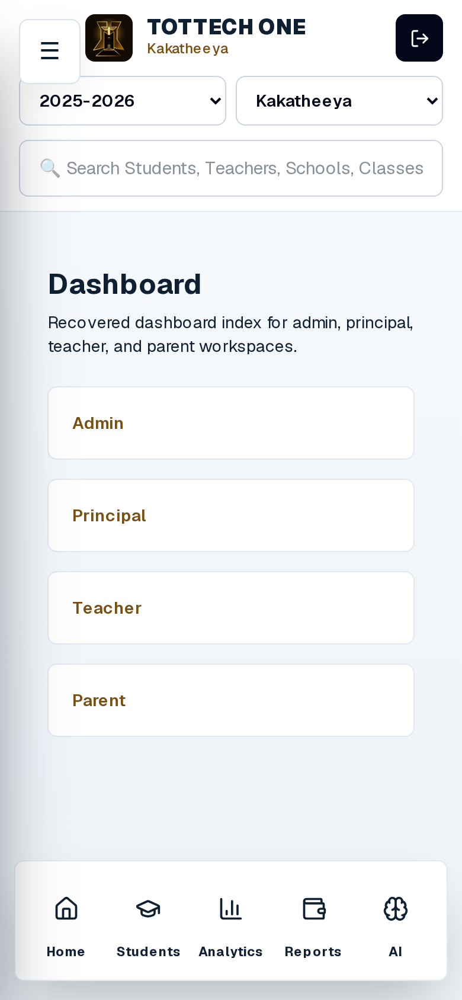
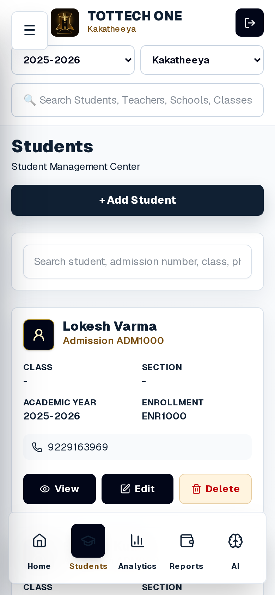
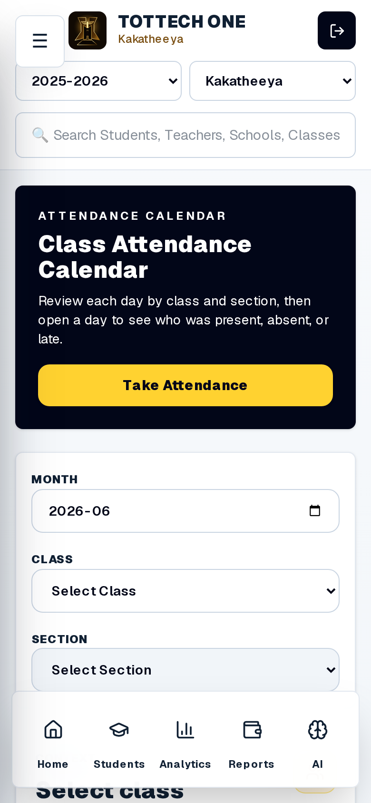
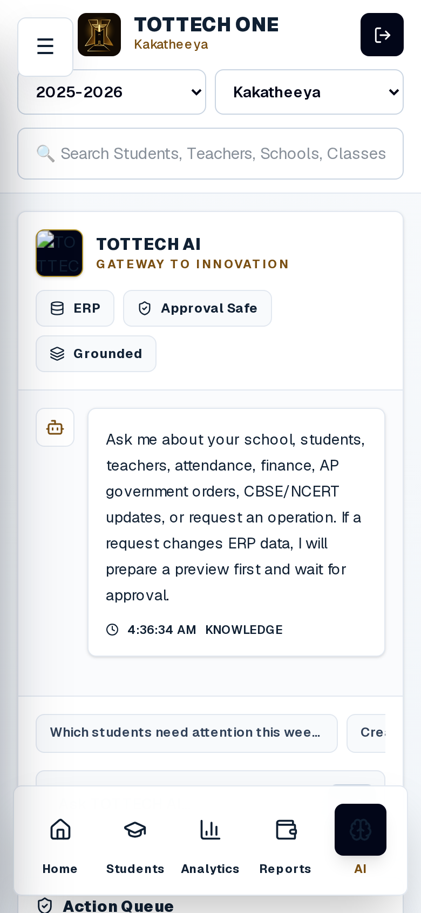
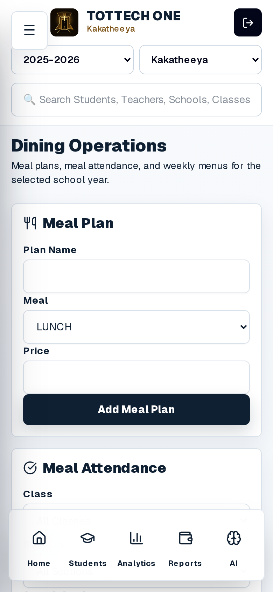
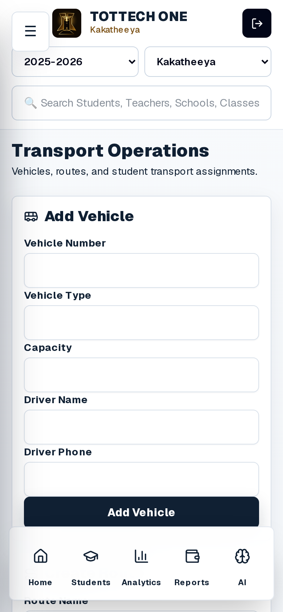
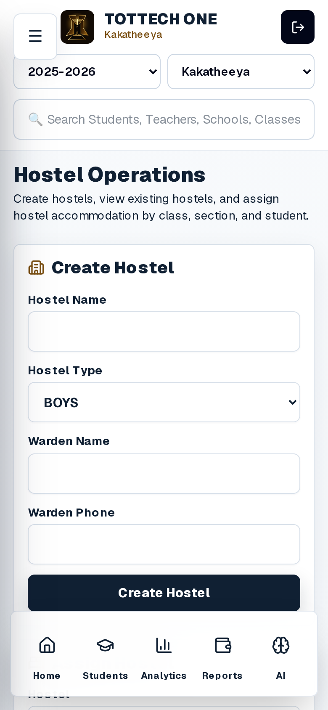
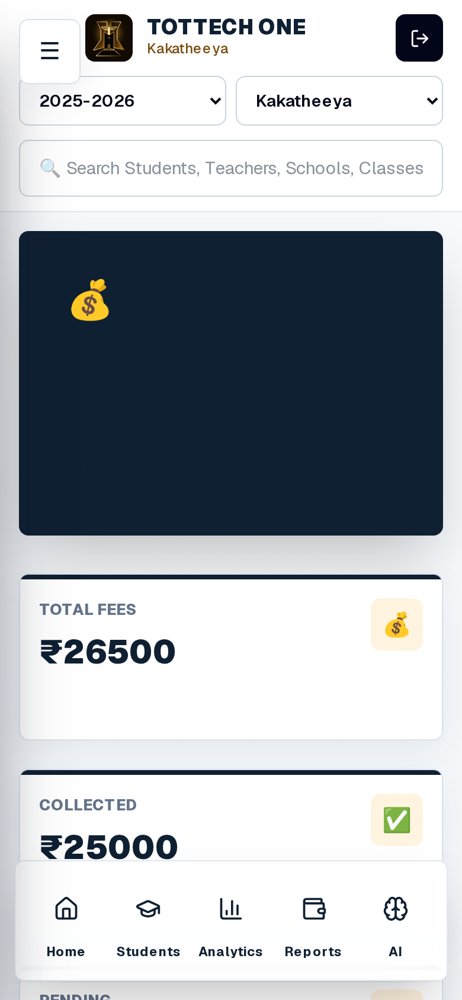

# MOBILE EXPERIENCE PROOF AUDIT

Generated: 2026-06-06

Scope: audit only. No application code, CSS, routes, database schema, APK build, PM2 process, or Nginx process was modified.

## Executive Verdict

The previous claim that "mobile experience reconstruction completed" is **not proven**.

What is proven:

- The live production system renders 26 audited mobile-width web screens at HTTP 200.
- Current React Native source contains many premium command-center concepts.
- A current generated APK exists and is downloadable.
- TOTTECH AI has partial ChatGPT-style UI evidence in production mobile web.
- Student cards, attendance entry, attendance calendar, question papers, reports, and some academic workflows have visible mobile-responsive improvements.

What is not proven:

- The benchmark APK and current APK were not run side by side.
- No native APK screenshots were produced.
- No animation parity was proven.
- No offline attendance or offline dining parity was proven.
- Dashboard is not a visible School Command Center in production mobile web.
- Dining, Transport, and Hostel are still form-first screens, not operations centers.
- Current generated APK runtime parity is unverified.

Confirmed visible production mobile-web parity against APK intent: **39%**

Native generated APK parity: **UNPROVEN** because no emulator/device runtime screenshots could be produced in this VPS.

## Evidence Sources

| Evidence | Path / Result |
|---|---|
| Benchmark APK | `/opt/recovery/downloads/app-release (3).apk` |
| Current published APK | `/opt/tottech-one/public/downloads/apk-release.apk` |
| Current mobile source | `/opt/tottech-one/mobile/src` |
| Current production URL | `https://erp.tottechsolutions.com` |
| Production screenshots | `/opt/tottech-one/mobile-experience-proof-audit/screenshots/production-web-mobile` |
| First-viewport crops | `/opt/tottech-one/mobile-experience-proof-audit/screenshots/production-web-mobile/viewport` |
| Capture metadata | `/opt/tottech-one/mobile-experience-proof-audit/screenshots/production-web-mobile/results.json` |

## APK Runtime Screenshot Status

Native APK screenshots could not be produced honestly from this VPS.

Evidence:

- `adb devices` returned no connected devices.
- `/root/.android/avd` does not exist.
- Installed Android SDK packages include build tools, platform tools, NDK, and platforms only.
- No Android Emulator package is installed.
- No `emulator` binary is present under `/opt/android-sdk`.

Therefore:

- Benchmark APK screenshots: **not produced**
- Current generated APK screenshots: **not produced**
- APK animation proof: **not produced**
- Native APK interaction proof: **not produced**

This audit uses APK forensic evidence plus current production mobile-width screenshots. It does **not** claim native APK runtime parity.

## APK Identity Comparison

| Artifact | Package | Version Code | Version Name | Size |
|---|---|---:|---|---:|
| Benchmark APK | `com.mobile` | 3 | 1.2 | 60 MB |
| Current APK | `com.tottechonemobile` | 1 | 1.0 | 56 MB |

This proves the current APK is a rebuilt artifact, not the same mobile application binary as the benchmark APK.

## Screenshot Evidence

All screenshots below are current production mobile-width captures at `390x844`.

Representative current screenshots:

| Dashboard | Students |
|---|---|
|  |  |

| Attendance Calendar | TOTTECH AI |
|---|---|
|  |  |

| Dining | Transport |
|---|---|
|  |  |

| Hostel | Finance |
|---|---|
|  |  |

| Screen | Current Production Screenshot | Current Web Source | Current Mobile Source |
|---|---|---|---|
| Dashboard | [dashboard](mobile-experience-proof-audit/screenshots/production-web-mobile/viewport/dashboard.png) | `app/dashboard/page.tsx` | `mobile/src/screens/DashboardScreen.tsx` |
| Students | [students](mobile-experience-proof-audit/screenshots/production-web-mobile/viewport/students.png) | `app/students/list/page.tsx` | `mobile/src/screens/StudentsScreen.tsx` |
| Teachers | [teachers](mobile-experience-proof-audit/screenshots/production-web-mobile/viewport/teachers.png) | `app/teachers/page.tsx` | `mobile/src/screens/TeachersScreen.tsx` |
| Student Attendance | [attendance-students](mobile-experience-proof-audit/screenshots/production-web-mobile/viewport/attendance-students.png) | `app/attendance/students/page.tsx` | `mobile/src/screens/AttendanceScreen.tsx` |
| Attendance Calendar | [attendance-calendar](mobile-experience-proof-audit/screenshots/production-web-mobile/viewport/attendance-calendar.png) | `app/attendance/calendar/page.tsx` | `mobile/src/screens/AttendanceScreen.tsx` |
| Academics | [academics](mobile-experience-proof-audit/screenshots/production-web-mobile/viewport/academics.png) | `app/academics/page.tsx` | `mobile/src/screens/AcademicsScreen.tsx` |
| Homework | [homework](mobile-experience-proof-audit/screenshots/production-web-mobile/viewport/homework.png) | `app/academics/homework/page.tsx` | `mobile/src/screens/AcademicsScreen.tsx` |
| Exams | [exams](mobile-experience-proof-audit/screenshots/production-web-mobile/viewport/exams.png) | `app/academics/exams/page.tsx` | `mobile/src/screens/AcademicsScreen.tsx` |
| Question Papers | [question-papers](mobile-experience-proof-audit/screenshots/production-web-mobile/viewport/question-papers.png) | `app/academics/question-papers/page.tsx` | `mobile/src/screens/AcademicsScreen.tsx` |
| Marks | [marks-entry](mobile-experience-proof-audit/screenshots/production-web-mobile/viewport/marks-entry.png) | `app/academics/marks-entry/page.tsx` | `mobile/src/screens/AcademicsScreen.tsx` |
| Finance | [finance](mobile-experience-proof-audit/screenshots/production-web-mobile/viewport/finance.png) | `app/finance/page.tsx` | `mobile/src/screens/ApkRecoveredScreens.tsx` |
| Invoices | [finance-invoices](mobile-experience-proof-audit/screenshots/production-web-mobile/viewport/finance-invoices.png) | `app/finance/invoices/page.tsx` | `mobile/src/screens/ApkRecoveredScreens.tsx` |
| Dining | [dining](mobile-experience-proof-audit/screenshots/production-web-mobile/viewport/dining.png) | `app/dining/page.tsx` | `mobile/src/screens/DiningScreen.tsx` |
| Transport | [transport](mobile-experience-proof-audit/screenshots/production-web-mobile/viewport/transport.png) | `app/transport/page.tsx` | `mobile/src/screens/TransportScreen.tsx` |
| Hostel | [hostel](mobile-experience-proof-audit/screenshots/production-web-mobile/viewport/hostel.png) | `app/hostel/page.tsx` | `mobile/src/screens/HostelScreen.tsx` |
| Parent Portal | [parent-portal](mobile-experience-proof-audit/screenshots/production-web-mobile/viewport/parent-portal.png) | `app/parent-portal/page.tsx` | `mobile/src/screens/ApkRecoveredScreens.tsx` |
| War Room | [war-room](mobile-experience-proof-audit/screenshots/production-web-mobile/viewport/war-room.png) | `app/war-room/page.tsx` | `mobile/src/screens/ApkRecoveredScreens.tsx` |
| Automation / Operations | [automation-operations](mobile-experience-proof-audit/screenshots/production-web-mobile/viewport/automation-operations.png) | `app/operations/page.tsx` | `mobile/src/screens/OperationalScreens.tsx` |
| Governance | [governance](mobile-experience-proof-audit/screenshots/production-web-mobile/viewport/governance.png) | `app/settings/roles/page.tsx` | `mobile/src/screens/ApkRecoveredScreens.tsx` |
| TOTTECH AI | [tottech-ai](mobile-experience-proof-audit/screenshots/production-web-mobile/viewport/tottech-ai.png) | `app/ai-school-copilot/page.tsx` | `mobile/src/screens/ApkRecoveredScreens.tsx` |
| AI Command Center | [ai-command-center](mobile-experience-proof-audit/screenshots/production-web-mobile/viewport/ai-command-center.png) | `app/ai-command-center/page.tsx` | `mobile/src/screens/ApkRecoveredScreens.tsx` |
| SchoolGPT | [schoolgpt](mobile-experience-proof-audit/screenshots/production-web-mobile/viewport/schoolgpt.png) | `app/ai-school-copilot/page.tsx` | `mobile/src/screens/ApkRecoveredScreens.tsx` |
| Notifications | [notifications](mobile-experience-proof-audit/screenshots/production-web-mobile/viewport/notifications.png) | `app/communication/page.tsx` | `mobile/src/screens/ApkRecoveredScreens.tsx` |
| User Management | [user-management](mobile-experience-proof-audit/screenshots/production-web-mobile/viewport/user-management.png) | `app/settings/users/page.tsx` | `mobile/src/screens/ApkRecoveredScreens.tsx` |
| Reports | [reports](mobile-experience-proof-audit/screenshots/production-web-mobile/viewport/reports.png) | `app/reports/page.tsx` | `mobile/src/screens/ApkRecoveredScreens.tsx` |
| Principal Analytics | [principal-analytics](mobile-experience-proof-audit/screenshots/production-web-mobile/viewport/principal-analytics.png) | `app/principal-analytics/page.tsx` | `mobile/src/screens/ApkRecoveredScreens.tsx` |

Full-page screenshots are also present in the parent screenshot folder. Some are very tall; for example `students.png` is `780 x 626246`.

## Claim Verification

| Previous Claim | Proof Result | Evidence |
|---|---|---|
| Dashboard = School Command Center | **NOT PROVEN** | Current production screenshot shows "Recovered dashboard index for admin, principal, teacher, and parent workspaces" with four role cards. No visible KPIs, quick actions, risk, recent activity, or command-center dashboard. |
| Dining = Operations Center | **NOT PROVEN** | Current screenshot is form-first: Meal Plan form and Meal Attendance form. No visible meal analytics, inventory health, cost, wastage, kitchen production, AI recommendations, or operations dashboard. |
| Transport = Operations Center | **NOT PROVEN** | Current screenshot is form-first: Add Vehicle form. No visible route utilization, vehicle status, trip risk, assignment health, revenue, or AI insight. |
| Hostel = Operations Center | **NOT PROVEN** | Current screenshot is form-first: Create Hostel form. No visible occupancy, vacancy, allocations, movement, attendance, revenue, or AI insight. |
| TOTTECH AI = ChatGPT Enterprise Experience | **PARTIAL** | Current screenshot shows chat-like workspace, grounding badges, suggested prompt chips, and approval-safe language. Missing visible multi-session history, citations panel, observability dashboard, mode switcher, and approval queue in first viewport. |
| APK built | **ARTIFACT EXISTS, RUNTIME UNPROVEN** | APK exists at `/opt/tottech-one/public/downloads/apk-release.apk`. It is package `com.tottechonemobile` version `1.0`, not benchmark package `com.mobile` version `1.2`. It was not run in this audit. |
| Premium black/white/gold theme | **PARTIAL** | Header, cards, and buttons use black/white/gold in many screenshots. Some pages still have blank hero areas, form-first layouts, and insufficient hierarchy. |

## Command-Center Capability Matrix

Status values: `Present`, `Partial`, `Missing`, `Not Proven`.

| Screen | Executive Header | KPIs | Quick Actions | Timeline | AI Insights | Search | Filters | Drilldowns | Recent Activity | Risk Indicators | Approval Queue | Verdict |
|---|---|---|---|---|---|---|---|---|---|---|---|---|
| Dashboard | Partial | Missing | Missing | Missing | Missing | Present | Present | Missing | Missing | Missing | Missing | Not a command center |
| Finance | Partial | Present | Partial | Missing | Missing | Present | Partial | Partial | Missing | Missing | Missing | Partial finance dashboard |
| Dining | Partial | Missing | Partial | Missing | Missing | Partial | Partial | Missing | Missing | Missing | Missing | Form-first, not operations center |
| Transport | Partial | Missing | Partial | Missing | Missing | Partial | Partial | Missing | Missing | Missing | Missing | Form-first, not operations center |
| Hostel | Partial | Missing | Partial | Missing | Missing | Partial | Partial | Missing | Missing | Missing | Missing | Form-first, not operations center |
| TOTTECH AI | Present | Partial | Present | Missing | Present | Partial | Missing | Partial | Partial | Missing | Partial | Partial ChatGPT-style workspace |
| Reports | Present | Present | Present | Missing | Missing | Missing | Missing | Partial | Missing | Missing | Missing | Partial evidence center |
| Attendance Calendar | Present | Partial | Present | Missing | Missing | Missing | Present | Partial | Missing | Missing | Missing | Partial workflow center |
| Student Attendance | Present | Present | Present | Missing | Missing | Missing | Present | Missing | Missing | Missing | Missing | Working entry workflow, not analytics center |
| Academics | Partial | Missing | Present | Missing | Missing | Present | Partial | Partial | Missing | Missing | Missing | Module index plus workflows |

## Screen Parity Scores

Scoring is based on visible production mobile-width screenshots and reachable workflow evidence only. Native APK runtime parity is not scored because no APK screenshots were possible.

| Screen | Visual Parity | Interaction Parity | Workflow Parity | Navigation Parity | Animation Parity | Premium Parity | Evidence-Based Status |
|---|---:|---:|---:|---:|---:|---:|---|
| Dashboard | 35% | 20% | 20% | 45% | 0% | 35% | Missing command-center experience |
| Students | 65% | 55% | 55% | 60% | 0% | 65% | Partial, strongest CRUD/card experience |
| Teachers | 60% | 50% | 45% | 60% | 0% | 60% | Partial |
| Student Attendance | 65% | 55% | 60% | 60% | 0% | 65% | Partial/working entry flow |
| Attendance Calendar | 68% | 55% | 55% | 60% | 0% | 68% | Partial |
| Academics | 58% | 50% | 50% | 60% | 0% | 55% | Partial |
| Homework | 50% | 45% | 45% | 55% | 0% | 50% | Partial |
| Exams | 55% | 50% | 50% | 55% | 0% | 52% | Partial |
| Question Papers | 60% | 55% | 55% | 55% | 0% | 55% | Partial |
| Marks | 55% | 50% | 55% | 55% | 0% | 52% | Partial |
| Finance | 45% | 35% | 35% | 45% | 0% | 42% | Partial, weak command-center proof |
| Dining | 38% | 35% | 35% | 42% | 0% | 35% | Form-first, not APK operations center |
| Transport | 38% | 35% | 35% | 42% | 0% | 35% | Form-first, not APK operations center |
| Hostel | 38% | 35% | 35% | 42% | 0% | 35% | Form-first, not APK operations center |
| Parent Portal | 35% | 30% | 25% | 40% | 0% | 35% | Partial/missing parent workflow depth |
| War Room | 50% | 35% | 30% | 45% | 0% | 45% | Partial |
| Automation | 45% | 30% | 20% | 45% | 0% | 40% | Mostly shell/overview |
| Governance | 45% | 35% | 35% | 45% | 0% | 40% | Partial |
| TOTTECH AI | 60% | 50% | 45% | 55% | 0% | 58% | Partial ChatGPT-style proof |
| SchoolGPT | 60% | 50% | 45% | 55% | 0% | 58% | Same surface as TOTTECH AI |
| Notifications | 35% | 30% | 25% | 40% | 0% | 35% | Partial |
| User Management | 45% | 40% | 40% | 45% | 0% | 40% | Partial |
| Reports | 60% | 45% | 45% | 55% | 0% | 60% | Partial, visibly improved |
| Principal Analytics | 60% | 45% | 45% | 55% | 0% | 60% | Partial, visibly improved |

## Requested Parity Totals

| Area | Score | Basis |
|---|---:|---|
| Dashboard Parity | 26% | Production screenshot contradicts School Command Center claim. |
| Finance Parity | 34% | KPIs exist, but command center and invoice workflow are not first-viewport obvious. |
| Dining Parity | 31% | Form-first; APK operations-center claims not visible. |
| Transport Parity | 31% | Form-first; no visible route utilization/vehicle status command center. |
| Hostel Parity | 31% | Form-first; no visible occupancy/allocation command center. |
| TOTTECH AI Parity | 45% | Chat framing and grounding visible, but enterprise ChatGPT workspace incomplete. |
| Overall Mobile Web APK Parity | 39% | Average of visible UX/workflow evidence across audited screens. |
| Native Generated APK Parity | Unproven | No emulator/device screenshots; current APK was not run. |

## TOTTECH AI ChatGPT-Style Verification

| Capability | Status | Evidence |
|---|---|---|
| Conversation history | Partial | Current screen shows a conversation-style message area; no visible multi-session history/sidebar. |
| Multi-session chat | Missing | No visible session list or conversation switching in screenshot. |
| Suggested prompts | Present | Prompt chips are visible in screenshot. |
| Knowledge search | Partial | Prompt can ask education/school questions; no visible knowledge search panel. |
| ERP grounding | Present | ERP/Grounded badges visible. |
| Source citations | Partial/Missing | Source/citation UI is not visible before a query; source strings exist in mobile source. |
| Action previews | Partial | Approval-safe action layer exists in source and lower page sections, but not proven end-to-end in screenshot. |
| Approval workflow | Partial | Approval-safe language visible; source calls `/api/tottech-ai/actions`; no execution proof. |
| Pending approvals | Partial | Source has pending approvals UI; first viewport only hints at action queue below fold. |
| AI observability | Partial | Source loads `/api/tottech-ai/observability`; not visible as a dashboard in screenshot. |
| Teacher mode | Partial | Source contains mode chips; not visible in first screenshot viewport. |
| Parent mode | Partial | Source contains mode chips; not visible in first screenshot viewport. |
| Student mode | Partial | Source contains mode chips; not visible in first screenshot viewport. |
| Executive mode | Partial | Source contains mode chips; not visible in first screenshot viewport. |

Verdict: TOTTECH AI is a **partial ChatGPT-style workspace**, not yet ChatGPT Enterprise parity.

## APK Reference Evidence

The benchmark APK proves these mobile UX/product concepts by extracted strings and screen identifiers:

- `AI Command Center`
- `AI Brain Analyzing School Data`
- `Conversational ERP Intelligence`
- `SchoolGPT`
- `Student Workspace`
- `Teacher Workspace`
- `Finance Command Center`
- `Invoice Generation Wizard`
- `Dining Attendance Intelligence`
- `Offline-first daily marking`
- `Dining Attendance draft saved offline. It will sync when you are online.`
- `Monthly Cost Tracking`
- `Food Wastage Analytics`
- `Transport Admin`
- `Route utilization`
- `Hostel Command`
- `War Room`
- `Workflow Builder`
- `Audit trail, activity history and security evidence`
- `Governance`
- `Knowledge Base`

The current APK also contains many reconstructed strings, including command-center and operations language. That is source/artifact evidence, not runtime visual proof.

## Current Mobile Source Evidence

Current React Native source contains stronger command-center work than the production mobile-web screenshots show:

| Source File | Evidence |
|---|---|
| `mobile/src/screens/DashboardScreen.tsx` | Contains `School Command Center`, KPI grid, quick actions, AI insight card, and operating centers. |
| `mobile/src/screens/DiningScreen.tsx` | Contains dining operations, attendance, inventory, production, wastage, and AI insight sections. |
| `mobile/src/screens/TransportScreen.tsx` | Contains route utilization, assignments, trip events, and AI insight sections. |
| `mobile/src/screens/HostelScreen.tsx` | Contains hostels, allocations, attendance, movement history, and AI insight sections. |
| `mobile/src/screens/ApkRecoveredScreens.tsx` | Contains TOTTECH AI conversation workspace, approval-safe action layer, pending approvals, observability, knowledge base, reports, governance, and recovered APK feature screens. |
| `mobile/src/screens/AcademicsScreen.tsx` | Contains API-backed exams, exam schedule, question papers, homework, and marks entry workflows. |

But this source evidence cannot be counted as visual parity until the generated APK is run and screenshot-tested.

## Top 25 Remaining APK Experience Gaps

1. Native APK runtime screenshots are missing; current APK parity is unproven.
2. Dashboard production mobile web is not a School Command Center.
3. Current generated APK package/version differs from benchmark APK.
4. No side-by-side benchmark APK vs current APK screenshots.
5. No animation/reveal/loading-state proof.
6. Dining is form-first, not an operations center.
7. Transport is form-first, not an operations center.
8. Hostel is form-first, not an operations center.
9. Offline attendance is not visually proven.
10. Offline dining/recovery is not visually proven.
11. Dashboard lacks visible KPIs, recent activity, risks, and AI insight cards.
12. Finance has KPIs but weak command-center hierarchy and a mostly blank hero.
13. Invoice Generation Wizard is not visible as a mobile-first command workflow.
14. Concessions 360 is not proven as a mobile workflow.
15. TOTTECH AI lacks visible multi-session conversation history.
16. TOTTECH AI lacks visible source citations panel.
17. TOTTECH AI lacks visible mode switching in the first viewport.
18. TOTTECH AI observability is not visible as a mobile dashboard.
19. AI approval workflow is partial and not end-to-end screenshot-proven.
20. Parent Portal is not proven as a complete mobile parent workflow.
21. Governance is partial; not a complete mobile governance center.
22. Automation is not proven as a working workflow builder.
23. War Room is partial; no visible command actions or closure workflow.
24. Several screens still use recovered/overview card language instead of operational workflows.
25. Bottom mobile navigation hides lower content on some first-viewport captures, reducing usability proof.

## Bottom Line

The correct status is:

- Mobile source reconstruction: **partial**
- Production mobile web experience: **partial**
- Native current APK visual parity: **unproven**
- Benchmark APK parity: **not achieved**
- Previous "mobile experience reconstruction completed" claim: **not supported by evidence**

Next proof step should be a real Android runtime comparison on an emulator or physical device with screenshots from:

1. `/opt/recovery/downloads/app-release (3).apk`
2. `/opt/tottech-one/public/downloads/apk-release.apk`

Only then should native Mobile APK Parity be recalculated.
